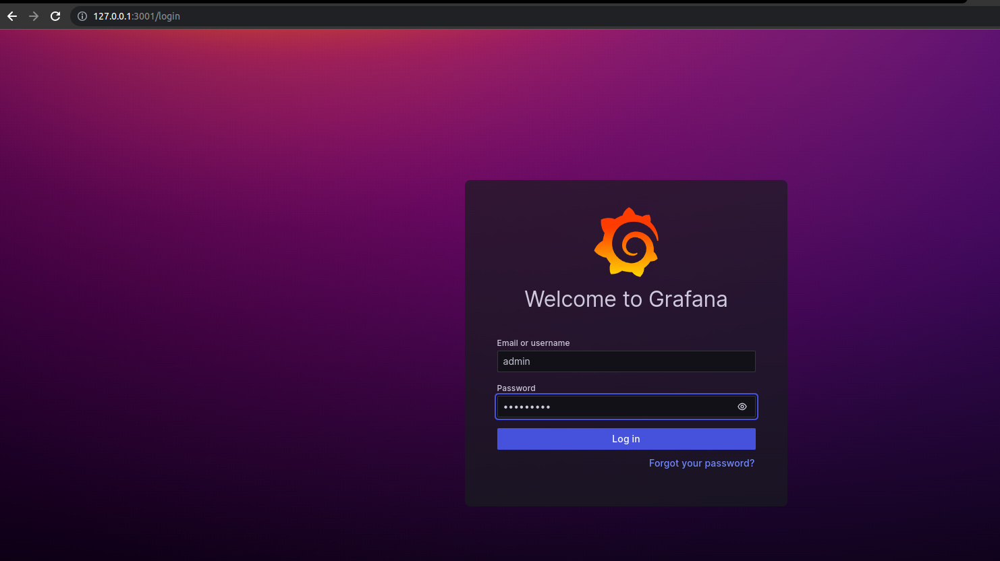
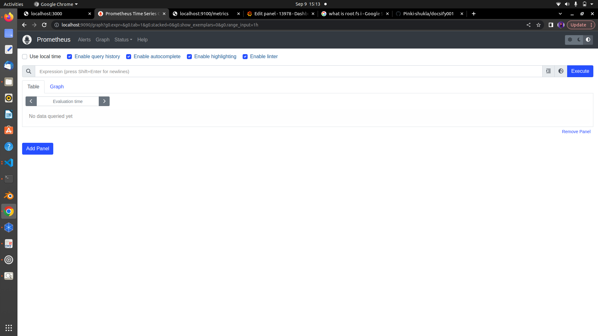

<center> <u> <h1 style="font-size: 50px;">Grafana Setup Documentation</center></h1> </u> </center><br>

## Task requirement:
"Setting Up Monitoring Infrastructure with Grafana, Prometheus, and Node Exporter".<br>
## Monitoring :

Regular collection of information and data to measure progress of projects and activities so we can track performance and resources utilization over time.
## System Configuration:

* OS Name : Ubuntu 20.04.6 LTS
* Podman version:- 3.4.2
* RAM : 5.6 GiB
* CPU : 12
* STORAGE : 512.1 GB
## Prerequisite tools:
- Podman 
- Grafana
- Prometheus
- Node-exporter
# Definition of tools
## Podman: 
Podman is an open source tool for developing, managing, and running containers
on your Linux® system
## Grafana :

Grafana open-source software enables you to query, visualize, alert on, and explore your metrics, logs, and traces wherever they are stored.

* Query
* Visualise
* Alert
## Prometheus :

Prometheus is an open source monitoring solution written in Go that collects metrics data and stores that data in a time series database. <br>
Grafana allows to visualize the data stored in prometheus.<br>
## Node-exporter:<br>
Node Exporter is a software tool that collects system-level metrics from servers and nodes, exposing them in a format that can be scraped by Prometheus for monitoring and analysis.<br>
Node Exporter collects a wide range of system metrics, including CPU Usage, Memory Usage, Disk Usage, System load.<br>

# Installation Process:

## Step-1 Install podman:

- Firstly, update your system.


```
sudo apt update
```

- Install podman by using this command.

```
sudo apt install -y podman
```

<b>Note:-</b> Follow these commands one by one if podman not installed 

```
 source /etc/os-release
```
- This command reads and loads the information from the /etc/os-release file into the current shell environment. It's used to determine the version and other details about the operating system, which is required for configuring the package repository URL.
```
 sudo sh -c "echo 'deb https://download.opensuse.org/repositories/devel:/kubic:/libcontainers:/stable/xUbuntu_$(lsb_release -rs)/ /' > /etc/apt/sources.list.d/devel:kubic:libcontainers:stable.list"
```
- This command adds a new software repository to the system's APT package manager. It specifies the URL for the Podman repository based on the Ubuntu version obtained using lsb_release -rs. The repository URL is added to a new file in the /etc/apt/sources.list.d/ directory.
```
  wget https://download.opensuse.org/repositories/devel:/kubic:/libcontainers:/stable/xUbuntu_$(lsb_release -rs)/Release.key  
```
-  This command downloads the GPG key used to verify the packages from the Podman repository.
```
 sudo apt-key add - < Release.key
```
- This command adds the GPG key to the system's keyring. It's necessary for verifying the authenticity of packages from the repository.
```
 sudo apt update
```
- This command updates the local package database to include the newly added Podman repository.

```
sudo apt install -y podman
```
- Finally, this command installs Podman on your Ubuntu-based system. The -y flag is used to automatically answer "yes" to any confirmation prompts during the installation.

```
 podman --version
```

- After the installation is complete, you can check the version of Podman installed on your system by running this command. It will display the version number of Podman.

## Step-2 Create a Grafana container:
To run the latest stable version of Grafana, run the following command:

```
podman run -d -p 3001:3000 --name=grafana docker.io/grafana/grafana-enterprise

```


Where:

<b>  run</b> = run directly from the command line <br>
<b>d </b>= run in the background <br>
<b>p </b>= assign the port number, which in this case is 3001 <br>
<b>name</b> = assign a  name to the container, for example, grafana<br>

<b> docker.io/grafana/grafana-enterprise: </b> This is the name of the image we want to run inside the container. It's called 'grafana-enterprise,' and it's stored in a special place on the internet called 'Docker Hub.'

http://localhost:3001 hit on the web browser to see the Grafana login page in your web browser.




## Use these options to create dashboards and alerts.


## Step-3 Create Prometheus container on Podman:

- <b>Create directory :-</b>
```
mkdir prometheus
```
- <b>Create file:-</b>

Create a file name "prometheus.yml"  into the prometheus directory which you have created above.
Go inside the "prometheus" directory by using cd command.

```
cd prometheus
```
Now create "prometheus.yml' file into the prometheus directory.
```

 vim prometheus.yml
 ```
  #### prometheus.yml is a configuration file of prometheus.

(push all the data in your prometheus.yml file which has been given below)

```
global:
  scrape_interval: 5s
  external_labels:
	monitor: 'node'

scrape_configs:
  - job_name: 'prometheus'
	static_configs:
  	- targets: ['192.168.1.57:9090']

  - job_name: 'node-exporter'
	static_configs:
  	- targets: ['192.168.1.57:9100']

  ```
- job_name: 'prometheus'
	static_configs:
  	- targets: ['192.168.1.57:9090']<br>
  (In target you have to assign your IP address also provide the port of prometheus which you will assign while creating prometheus container)

- job_name: 'node-exporter'
	static_configs:
  	- targets: ['192.168.1.57:9100']<br>
  (In target you have to assign your IP address also provide the port of node-exporter which you will assign while creating node-exporter container)


```
  podman run -d --name prometheus -p 9090:9090 -v /home/pinki/prometheus/prometheus.yml:/etc/prometheus/prometheus.yml docker.io/prom/prometheus
 ```

 

<b>podman run:</b> This part of the command instructs podman to run a container.

<b>d:</b> This flag stands for "detached" mode. It runs the container in the background

<b>--name prometheus:</b> This flag assigns a name to the container. In this case, the container is named "prometheus."

<b>-p 9090:9090:</b> This flag specifies port mapping. It tells podman to map port 9090 on the host to port 9090 inside the container. 

<b>-v /home/pinki/prometheus/prometheus.yml:/etc/prometheus/prometheus.yml:</b> This flag specifies a volume mount. It connects a directory or file on your host system to a location inside the container.

In this case, it's mounting the file /home/pinki/prometheus/prometheus.yml from your host into the container at /etc/prometheus/prometheus.yml 

* <b>" /home/pinki/prometheus/prometheus.yml":</b> This is the path to the Prometheus configuration file on your host. It's being shared with the container.  

*  <b>"/etc/prometheus/prometheus.yml": </b>This is where Prometheus expects its configuration file to be inside the container.

<b> docker.io/prom/prometheus: </b>This is the name of the Docker image you want to run as a container. It specifies the image's repository and name. In this case, you are running the "prometheus" image from the "prom" repository on Docker Hub

http://localhost:9090 on the web browser to see the prometheus.


  


  

 ## Step-4 Create Node exporter container on podman

```

podman run -d --name=node-exporter -p 9100:9100 -v"/:/host:ro,rslave" quay.io/prometheus/node-exporter:latest --path.rootfs=/host

 ```


 <b>podman run:</b> This part of the command instructs podman to run a container.

 <b>-d:</b> This flag stands for "detached" mode.</b>

 <b>--name=node-exporter:</b> This flag assigns a name to the container. In this case, the container is named "node-exporter." 

 <b>-p 9100:9100: </b>This flag specifies port mapping. it allows you to access the service inside the container via port 9100 on your host.

 <b>"/:/host:ro,rslave": </b> This part specifies the volume configuration. It tells podman to mount the root directory of your host (represented by <b>"/"</b>) to the <b>"/host"</b> directory inside the container. The<b> "ro"</b> option stands for "read-only," which means the container can read the files on the host but can't modify them. The rslave option is related to mount propagation, allowing mounted file systems to be shared among containers.

<b>quay.io/prometheus/node-exporter:latest:</b> In this case, you are running the "node-exporter" image from the "prometheus" repository on Quay.io. The ":latest" tag indicates that you want to use the latest version of this image.

<b>--path.rootfs=/host:</b> This is an additional command passed to the container. It specifies the root file system path as "/host" inside the container. This can be important for some containerized applications to correctly access system resources.

 http://localhost:9100 on the web browser to see Node-expoerter.

 
 ## Now you can see our all containers are ready grafana,prometheus and node-exporter

  ```
 podman ps
  ```
The <b>podman ps</b> command is used to list the currently running containers on your system. It provides information about the containers that are actively running and includes details such as the container ID, names, status, and other relevant information.

 
## Grafana setup has been ready with Dashboard. 


    

    


    


